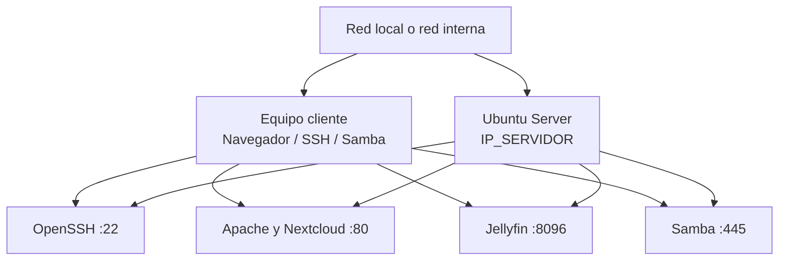

# Ubuntu Home Server: guía completa del proyecto

Guía paso a paso para construir un servidor doméstico sobre **Ubuntu Server 24.04 LTS** en VirtualBox. El proyecto reúne administración Linux, acceso remoto por SSH, red, firewall, usuarios, Samba, Apache, Nextcloud y Jellyfin.

> Esta guía es una versión nueva y ampliada de `READMEGeneral.md`. El archivo original se conserva sin modificaciones.

## Índice

1. [Objetivo y arquitectura](#1-objetivo-y-arquitectura)
2. [Requisitos previos](#2-requisitos-previos)
3. [Crear el repositorio](#3-crear-el-repositorio)
4. [Crear la máquina virtual](#4-crear-la-máquina-virtual)
5. [Instalar Ubuntu Server](#5-instalar-ubuntu-server)
6. [Configurar SSH y la red](#6-configurar-ssh-y-la-red)
7. [Actualizar el sistema e instalar herramientas](#7-actualizar-el-sistema-e-instalar-herramientas)
8. [Crear usuarios y administrar el sistema](#8-crear-usuarios-y-administrar-el-sistema)
9. [Aplicar seguridad básica](#9-aplicar-seguridad-básica)
10. [Compartir archivos con Samba](#10-compartir-archivos-con-samba)
11. [Instalar y configurar Apache](#11-instalar-y-configurar-apache)
12. [Instalar Nextcloud](#12-instalar-nextcloud)
13. [Crear el servidor multimedia con Jellyfin](#13-crear-el-servidor-multimedia-con-jellyfin)
14. [Direcciones y comprobaciones finales](#14-direcciones-y-comprobaciones-finales)
15. [Solución de problemas](#15-solución-de-problemas)

---

## 1. Objetivo y arquitectura

El resultado será una red de laboratorio en la que un Ubuntu Server ofrece servicios a un equipo cliente, por ejemplo Kali Linux, Windows o el sistema anfitrión.



### Servicios y puertos principales

| Servicio | Uso | Dirección de prueba |
| :--- | :--- | :--- |
| SSH | Administración remota | `ssh USUARIO_ADMIN@IP_SERVIDOR` |
| Apache | Sitios web | `http://IP_SERVIDOR` |
| Nextcloud | Archivos y nube privada | `http://IP_SERVIDOR` |
| Jellyfin | Biblioteca y reproducción multimedia | `http://IP_SERVIDOR:8096` |
| Samba | Carpeta compartida en la red | `\\IP_SERVIDOR\SharedFolder` |

Los nombres, IP, usuarios y contraseñas de esta guía son ejemplos. Sustituye siempre estos valores:

- `IP_SERVIDOR`: IP fija que se asignará al servidor, por ejemplo `192.168.1.100`.
- `IP_GATEWAY`: puerta de enlace del router, por ejemplo `192.168.1.1`.
- `USUARIO_ADMIN`: usuario administrador de Linux.
- `USUARIO_SAMBA`: usuario que tendrá acceso a Samba.
- `CAMBIAR_ESTA_CLAVE`: contraseña propia, nunca una contraseña de ejemplo.

---

## 2. Requisitos previos

- VirtualBox instalado.
- ISO de Ubuntu Server descargada desde [ubuntu.com/download/server](https://ubuntu.com/download/server).
- Al menos una máquina cliente para probar SSH y los servicios.
- Conexión de red entre el servidor y el cliente.
- Espacio suficiente para el sistema, las bases de datos y los medios.
- Un repositorio vacío en GitHub si se desea publicar esta documentación.

### Decidir el modo de red de VirtualBox

- **Adaptador puente:** el servidor obtiene una IP de la misma red que el equipo físico. Es la opción más sencilla para acceder desde otros dispositivos de la red local.
- **Red interna:** crea una red aislada entre máquinas virtuales. Es apropiada para un laboratorio privado, pero el anfitrión no accederá directamente sin configuración adicional.
- **NAT:** permite salir a Internet, pero puede dificultar el acceso entrante. Dos máquinas virtuales con NAT pueden recibir una IP interna igual, como `10.0.2.15`, y no comunicarse como se espera.

Para este proyecto, usa **Adaptador puente** o una **Red interna** común para el servidor y el cliente. Anota el nombre exacto de la interfaz de red que muestre el instalador.

---

## 3. Crear el repositorio

Los siguientes comandos se ejecutan en el equipo donde se guardará la documentación, no necesariamente dentro del servidor Ubuntu.

```bash
mkdir proyecto-servidor-medios
cd proyecto-servidor-medios
git init
git branch -M main
git remote add origin URL_DEL_REPOSITORIO
```

Copia las notas y los archivos Markdown dentro del directorio y crea el primer commit:

```bash
git add .
git commit -m "Documentar servidor Ubuntu y servicios"
git push -u origin main
```

Comprueba el remoto antes de publicar:

```bash
git remote -v
git status
```

> Si el repositorio usa la rama `master`, conserva ese nombre en los comandos. `main` es el nombre recomendado actualmente, pero lo importante es que la rama local y la remota coincidan.

---

## 4. Crear la máquina virtual

1. Abre VirtualBox y selecciona **Nueva**.
2. Asigna un nombre, por ejemplo `ubuntu-server`.
3. Selecciona la ISO de Ubuntu Server 24.04 LTS.
4. Asigna recursos adecuados al equipo disponible. Como punto de partida: 2 CPU, 4 GB de RAM y un disco virtual de al menos 25 GB. Jellyfin y Nextcloud necesitarán espacio adicional.
5. Configura el adaptador de red según la decisión del apartado anterior.
6. Inicia la máquina y abre la consola de instalación.

---

## 5. Instalar Ubuntu Server

En el instalador, utiliza esta configuración de referencia:

| Pantalla | Selección |
| :--- | :--- |
| Idioma | `English` |
| Teclado | `Spanish Latin America` o la distribución real del teclado |
| Tipo de instalación | `Ubuntu Server` estándar |
| Red | DHCP durante la instalación inicial |
| Proxy | Vacío, salvo que la red exija uno |
| Mirror | Valor predeterminado de Ubuntu |
| Almacenamiento | Usar todo el disco virtual |
| Ubuntu Pro | `Skip for now` |
| SSH | Puede omitirse; se instalará después de forma explícita |
| Snaps | Omitir para comenzar con un servidor limpio |

En **Profile configuration**, crea el usuario que administrará el servidor:

- Nombre: el nombre real del administrador.
- Server name: `ubuntu-server`.
- Username: el valor que usarás como `USUARIO_ADMIN`.
- Password: una contraseña única y segura.

Finaliza la instalación, reinicia y retira la ISO si VirtualBox vuelve a iniciar el instalador.

Inicia sesión localmente y verifica que el sistema responda:

```bash
whoami
hostname
ip a
```

---

## 6. Configurar SSH y la red

### 6.1 Instalar y habilitar OpenSSH

En el servidor Ubuntu:

```bash
sudo apt update
sudo apt install openssh-server -y
sudo systemctl enable --now ssh
sudo systemctl status ssh
```

El estado esperado es `active (running)`.

Desde el equipo cliente, comprueba primero la red:

```bash
ping IP_SERVIDOR
```

Después conecta por SSH:

```bash
ssh USUARIO_ADMIN@IP_SERVIDOR
```

Acepta la huella del servidor cuando corresponda e introduce la contraseña del usuario de Ubuntu.

### 6.2 Asignar una IP estática con Netplan

Una IP fija evita que el router cambie la dirección que usan SSH, Apache, Nextcloud, Jellyfin y Samba.

1. Identifica la interfaz:

```bash
ip link show
ip a
```

Ejemplos habituales: `enp0s3`, `enp0s8` o `ens33`.

2. Identifica la puerta de enlace:

```bash
ip route
```

La dirección que aparece después de `default via` es `IP_GATEWAY`.

3. Revisa el nombre del archivo Netplan:

```bash
ls /etc/netplan/
```

Edita el archivo existente, por ejemplo:

```bash
sudo nano /etc/netplan/50-cloud-init.yaml
```

Usa espacios, nunca tabulaciones, y sustituye `enp0s3`, la IP y el gateway por los valores reales:

```yaml
network:
  version: 2
  ethernets:
    enp0s3:
      dhcp4: false
      addresses:
        - 192.168.1.100/24
      routes:
        - to: default
          via: 192.168.1.1
      nameservers:
        addresses: [8.8.8.8, 1.1.1.1]
```

4. Valida antes de aplicar. Si estás conectado por SSH, `netplan try` es más seguro porque revierte el cambio si no lo confirmas:

```bash
sudo netplan try
```

Si la conexión continúa funcionando, confirma y aplica:

```bash
sudo netplan apply
ip a
ip route
ping -c 4 8.8.8.8
```

> Haz este cambio con acceso a la consola de VirtualBox disponible. Una IP, interfaz o gateway incorrectos pueden desconectar SSH.

---

## 7. Actualizar el sistema e instalar herramientas

Ejecuta la actualización en este orden:

```bash
sudo apt update
sudo apt upgrade -y
```

Instala utilidades básicas:

```bash
sudo apt install curl net-tools htop git -y
```

Verifica la instalación:

```bash
curl --version
git --version
htop --version
ifconfig
```

Funciones principales:

- `curl`: solicitudes HTTP/HTTPS y pruebas de servicios.
- `net-tools`: herramientas clásicas de red, incluido `ifconfig`.
- `htop`: monitor interactivo de procesos y recursos.
- `git`: clonado y control de versiones.

---

## 8. Crear usuarios y administrar el sistema

### 8.1 Crear un administrador adicional

No es conveniente depender de un solo usuario. Crea otro usuario y agrégalo al grupo `sudo`:

```bash
sudo adduser USUARIO_ADMIN_NUEVO
sudo usermod -aG sudo USUARIO_ADMIN_NUEVO
groups USUARIO_ADMIN_NUEVO
```

Cierra la sesión y vuelve a entrar con el nuevo usuario para comprobar sus permisos:

```bash
ssh USUARIO_ADMIN_NUEVO@IP_SERVIDOR
sudo whoami
```

El resultado esperado de `sudo whoami` es `root`.

### 8.2 Comandos cotidianos

```bash
# Mostrar archivos, incluidos los ocultos, con permisos y propietarios
ll

# Cambiar al entorno completo de otro usuario
su - USUARIO

# Crear un directorio de prueba y darle acceso exclusivo al propietario
mkdir ~/test
sudo chmod 700 ~/test

# Cambiar propietario y grupo
sudo chown USUARIO:USUARIO ~/test

# Ver procesos y recursos
ps aux
htop

df -h
free -h
lsblk

# Reiniciar o apagar
sudo reboot
sudo shutdown -h now
```

Los permisos `700` significan lectura, escritura y ejecución para el propietario, y ningún permiso para el resto.

---

## 9. Aplicar seguridad básica

### 9.1 Firewall UFW

Primero permite SSH. Si activas UFW antes, puedes bloquear tu propia conexión:

```bash
sudo apt install ufw -y
sudo ufw allow OpenSSH
sudo ufw enable
sudo ufw status verbose
```

Abre únicamente los servicios que realmente vayas a usar:

```bash
sudo ufw allow 80/tcp       # Apache y Nextcloud
sudo ufw allow 8096/tcp     # Jellyfin
sudo ufw allow 137/udp      # Samba
sudo ufw allow 138/udp      # Samba
sudo ufw allow 139/tcp      # Samba
sudo ufw allow 445/tcp      # Samba
```

Comprueba las reglas:

```bash
sudo ufw status numbered
```

### 9.2 Actualizaciones automáticas

Instala el paquete de actualizaciones de seguridad automáticas:

```bash
sudo apt install unattended-upgrades -y
sudo dpkg-reconfigure --priority=low unattended-upgrades
```

Mantén también el hábito de revisar periódicamente:

```bash
sudo apt update
sudo apt upgrade -y
```

### 9.3 Claves SSH para otro administrador

Si ya tienes una clave SSH configurada para un usuario y necesitas copiarla a otro, ejecuta desde el servidor con cuidado:

```bash
sudo cp -r /home/USUARIO_ORIGEN/.ssh /home/USUARIO_DESTINO/
sudo chown -R USUARIO_DESTINO:USUARIO_DESTINO /home/USUARIO_DESTINO/.ssh
sudo chmod 700 /home/USUARIO_DESTINO/.ssh
sudo chmod 600 /home/USUARIO_DESTINO/.ssh/authorized_keys
```

Verifica que el nombre del archivo sea `authorized_keys` y prueba el acceso antes de cerrar la sesión actual.

---

## 10. Compartir archivos con Samba

Samba permite que equipos Linux y Windows accedan a una carpeta del servidor mediante SMB.

### 10.1 Instalar y crear la carpeta

```bash
sudo apt update
sudo apt install samba -y
sudo mkdir -p /srv/share
sudo chown -R USUARIO_SAMBA:USUARIO_SAMBA /srv/share
```

Crea una cuenta de Samba para un usuario Linux existente:

```bash
sudo smbpasswd -a USUARIO_SAMBA
sudo smbpasswd -e USUARIO_SAMBA
```

### 10.2 Configurar el recurso compartido

Haz una copia de seguridad y abre la configuración:

```bash
sudo cp /etc/samba/smb.conf /etc/samba/smb.conf.bak
sudo nano /etc/samba/smb.conf
```

Agrega al final:

```ini
[SharedFolder]
   path = /srv/share
   browseable = yes
   read only = no
   writable = yes
   valid users = USUARIO_SAMBA
   create mask = 0660
   directory mask = 0770
```

Valida y reinicia:

```bash
testparm
sudo systemctl enable --now smbd nmbd
sudo systemctl restart smbd nmbd
sudo systemctl status smbd nmbd
```

Desde Windows, escribe en el explorador:

```text
\\IP_SERVIDOR\SharedFolder
```

Usa las credenciales de `USUARIO_SAMBA`. Es preferible el acceso autenticado; no habilites invitados inseguros en una red real. Si el laboratorio usa Windows y se necesita esa opción, la política de inicio de sesión de invitados se modifica en el cliente mediante `gpedit.msc`, no en Ubuntu.

---

## 11. Instalar y configurar Apache

### 11.1 Instalar el servicio

```bash
sudo apt install apache2 -y
sudo systemctl enable --now apache2
sudo systemctl status apache2
```

Abre `http://IP_SERVIDOR` desde el cliente. La página predeterminada se sirve desde:

```text
/var/www/html
```

### 11.2 Publicar un sitio propio

Crea un directorio para el sitio:

```bash
sudo mkdir -p /var/www/mi-sitio
sudo chown -R $USER:$USER /var/www/mi-sitio
nano /var/www/mi-sitio/index.html
```

Ejemplo mínimo:

```html
<!doctype html>
<html lang="es">
<head>
  <meta charset="utf-8">
  <title>Mi servidor</title>
</head>
<body>
  <h1>Servidor Ubuntu funcionando</h1>
</body>
</html>
```

Para una prueba rápida también puedes visitar `http://IP_SERVIDOR/mi-sitio` si el directorio está dentro de `/var/www/html`. Para una configuración mantenible, crea un VirtualHost en `/etc/apache2/sites-available/mi-sitio.conf` y luego habilítalo:

```bash
sudo a2ensite mi-sitio.conf
sudo apache2ctl configtest
sudo systemctl reload apache2
```

El resultado esperado de `configtest` es `Syntax OK`.

---

## 12. Instalar Nextcloud

Nextcloud necesita PHP, MariaDB y Apache. Esta sección instala los paquetes usados por las notas del proyecto.

### 12.1 Instalar PHP, MariaDB y dependencias

```bash
sudo apt update
sudo apt install php php-gd php-mysql php-curl php-mbstring php-intl php-gmp php-bcmath php-xml php-imagick php-zip php-apcu php-json mariadb-server bzip2 wget -y
sudo systemctl enable --now mariadb
sudo systemctl status mariadb
```

Ejecuta el asistente de seguridad:

```bash
sudo mysql_secure_installation
```

Lee cada pregunta y elimina usuarios anónimos, bases de datos de prueba y accesos remotos de root cuando corresponda. No copies contraseñas de esta guía.

### 12.2 Crear la base de datos

Entra a MariaDB:

```bash
sudo mariadb
```

Ejecuta SQL sustituyendo los valores de ejemplo:

```sql
CREATE DATABASE nextcloud CHARACTER SET utf8mb4 COLLATE utf8mb4_general_ci;
CREATE USER 'nextclouduser'@'localhost' IDENTIFIED BY 'CAMBIAR_ESTA_CLAVE';
GRANT ALL PRIVILEGES ON nextcloud.* TO 'nextclouduser'@'localhost';
FLUSH PRIVILEGES;
EXIT;
```

Los nombres deben coincidir exactamente con los que usarás en el instalador web. Evita espacios dentro de nombres de usuario y contraseñas.

### 12.3 Descargar y preparar Nextcloud

```bash
cd /tmp
wget https://download.nextcloud.com/server/releases/latest.tar.bz2
sudo tar -xjf latest.tar.bz2 -C /var/www/
sudo chown -R www-data:www-data /var/www/nextcloud
sudo chmod -R 750 /var/www/nextcloud
```

### 12.4 Configurar Apache

Crea el archivo:

```bash
sudo nano /etc/apache2/sites-available/nextcloud.conf
```

Contenido de referencia:

```apache
<VirtualHost *:80>
    ServerName IP_SERVIDOR
    DocumentRoot /var/www/nextcloud

    <Directory /var/www/nextcloud>
        Require all granted
        AllowOverride All
        Options FollowSymLinks MultiViews
    </Directory>

    ErrorLog ${APACHE_LOG_DIR}/nextcloud_error.log
    CustomLog ${APACHE_LOG_DIR}/nextcloud_access.log combined
</VirtualHost>
```

Habilita el sitio y los módulos necesarios:

```bash
sudo a2ensite nextcloud.conf
sudo a2enmod rewrite headers env dir mime setenvif
sudo apache2ctl configtest
sudo systemctl reload apache2
```

### 12.5 Completar el instalador web

1. Abre `http://IP_SERVIDOR`.
2. Crea la cuenta administradora de Nextcloud.
3. Introduce como base de datos `nextcloud`.
4. Introduce el usuario `nextclouduser` y la contraseña elegida.
5. Usa `localhost` como servidor de base de datos.
6. Completa la instalación y prueba subir un archivo.

Si el sitio no aparece, revisa:

```bash
sudo systemctl status apache2
sudo tail -n 50 /var/log/apache2/nextcloud_error.log
sudo tail -n 50 /var/log/apache2/error.log
```

---

## 13. Crear el servidor multimedia con Jellyfin

### 13.1 Preparar las carpetas multimedia

```bash
sudo mkdir -p /srv/media/{peliculas,series,musica}
```

Después de instalar Jellyfin, asigna la carpeta al usuario del servicio para que pueda leer la biblioteca:

### 13.2 Agregar el repositorio e instalar Jellyfin

```bash
sudo mkdir -p /etc/apt/keyrings
wget -O- https://repo.jellyfin.org/jellyfin_team.gpg.key | gpg --dearmor | sudo tee /etc/apt/keyrings/jellyfin.gpg > /dev/null
. /etc/os-release
echo "deb [signed-by=/etc/apt/keyrings/jellyfin.gpg] https://repo.jellyfin.org/$ID $VERSION_CODENAME main" | sudo tee /etc/apt/sources.list.d/jellyfin.list
sudo apt update
sudo apt install jellyfin -y
sudo chown -R jellyfin:jellyfin /srv/media
```

Habilita y comprueba el servicio:

```bash
sudo systemctl enable --now jellyfin
sudo systemctl status jellyfin
```

Si el servicio está activo, abre:

```text
http://IP_SERVIDOR:8096
```

En el asistente web, configura el idioma, crea la cuenta de administración y agrega las bibliotecas apuntando a `/srv/media/peliculas`, `/srv/media/series` y `/srv/media/musica`.

### 13.3 Si Jellyfin no inicia

```bash
sudo systemctl status jellyfin
sudo journalctl -u jellyfin -n 100 --no-pager
df -h
sudo systemctl restart jellyfin
```

Comprueba especialmente el espacio disponible. Una máquina virtual con poco espacio puede impedir que Jellyfin arranque o que procese la biblioteca. Si amplías el disco virtual, todavía debes ampliar la partición y el sistema de archivos dentro de Ubuntu; aumentar solo el tamaño en VirtualBox no completa el proceso.

---

## 14. Direcciones y comprobaciones finales

Desde el cliente, prueba cada servicio:

```bash
# SSH
ssh USUARIO_ADMIN@IP_SERVIDOR

# HTTP
curl -I http://IP_SERVIDOR

# Puerto SSH
nc -zv IP_SERVIDOR 22

# Puerto Jellyfin
nc -zv IP_SERVIDOR 8096
```

En el servidor, revisa servicios y puertos:

```bash
sudo systemctl --failed
sudo systemctl status ssh apache2 mariadb smbd nmbd jellyfin
sudo ss -tulpn
sudo ufw status verbose
```

Lista de validación:

- [ ] El servidor conserva la IP fija después de reiniciar.
- [ ] SSH funciona con el usuario administrador.
- [ ] UFW permite únicamente los puertos necesarios.
- [ ] Samba permite crear y leer un archivo de prueba.
- [ ] Apache muestra el sitio web.
- [ ] MariaDB está activa y Nextcloud completa su instalación.
- [ ] Jellyfin muestra las bibliotecas multimedia.
- [ ] Existen copias de seguridad de la configuración y de los datos importantes.
- [ ] Las contraseñas reales no están escritas en el repositorio.

---

## 15. Solución de problemas

### No puedo conectarme por SSH

1. Comprueba la IP con `ip a`.
2. Comprueba que cliente y servidor estén en la misma red.
3. Ejecuta `ping IP_SERVIDOR` desde el cliente.
4. En la consola de VirtualBox, ejecuta:

```bash
sudo systemctl status ssh
sudo ss -tulpn | grep ':22'
sudo ufw status
```

Si ambas máquinas tienen la misma IP `10.0.2.15`, revisa el modo NAT y cambia a Adaptador puente o Red interna.

### No carga Apache, Nextcloud o Jellyfin

Comprueba primero el servicio, el puerto y los logs:

```bash
sudo systemctl status apache2 jellyfin
sudo ss -tulpn
sudo ufw status verbose
sudo journalctl -u jellyfin -n 50 --no-pager
```

Para Apache:

```bash
sudo apache2ctl configtest
sudo tail -n 50 /var/log/apache2/error.log
```

### Netplan dejó la red inaccesible

Usa la consola de VirtualBox, revisa la interfaz con `ip link show` y corrige el YAML. Antes de aplicar cambios futuros, utiliza `sudo netplan try` y conserva una sesión local abierta.

### Samba pide credenciales o no muestra la carpeta

```bash
testparm
sudo systemctl status smbd nmbd
sudo smbpasswd -a USUARIO_SAMBA
ls -ld /srv/share
```

Asegúrate de que el usuario existe en Linux y también en la base de usuarios de Samba.

### El sistema se queda sin espacio

```bash
df -h
sudo du -xh /var | sort -h | tail -n 20
```

Elimina solo archivos que identifiques con seguridad. Revisa especialmente bibliotecas multimedia, logs y el tamaño del disco virtual.

---

## Referencias del proyecto

La guía se elaboró a partir de las notas incluidas en este repositorio:

- `1CreacionDelRepositorio.txt`
- `2PasosParaCrearElServidor.txt`
- `3UtilizacionDelServidor.txt`
- `4ConfiguracionBasicaPostInstalacion.txt`
- `5ConfiguracionDeIPStatica.txt`
- `6ComandosBasicosDeAdministracion.txt`
- `SeguridadBasicaDelServidor.txt`
- `CompartirArchivosConSamba.txt`
- `InstalacionServidorWebApache2.txt`
- `ConfiguracionServidorWebApache2.txt`
- `CreacionDeNube.txt`
- `CreandoServidorDeMedios.txt`
